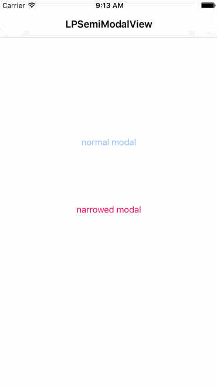

# LPSemiModalView

modal a view in semi window with CATransform 3D transformed efftect

# Install

- use cocoapods
```swift
pod 'LPSemiModalView', '~> 0.0.1'
```
- manual import
```swift
just download lib folder and add into your project
```

# Screenshot



# Release notes

- 0.0.1

`first release version`
